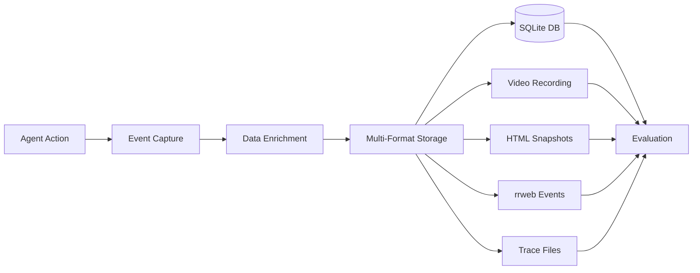

## Overview

LiteAgent implements comprehensive data collection to enable thorough analysis of agent behavior. Every interaction, decision, and outcome is captured in multiple formats for different analysis needs.

## Data Collection Pipeline



## Types of Data Collected

### 1. Interaction Events

Every agent action is recorded as an event in the database:

```python
class ActionEvent:
    event_type: str      # click, type, navigate, scroll
    xpath: str           # Element XPath
    class_name: str      # CSS classes
    element_id: str      # Element ID
    input_value: str     # Text input or selection
    url: str             # Current page URL
    additional_info: str # JSON metadata
    timestamp: float     # Time since last action
```

### 2. Visual Data

#### Screenshots

- Captured before/after major actions
- Full page and viewport captures
- PNG format with timestamps

#### Video Recording

- Complete session recording
- MP4 format for easy playback
- Synchronized with event timestamps

### 3. DOM Snapshots

HTML captures at key moments:

```python
# Captured at:
- Initial page load
- Before each interaction
- After page changes
- On errors or timeouts
```

### 4. Session Replay (rrweb)

Complete session reconstruction data:

```javascript
// rrweb event types
{
  type: 'Dom',          // DOM mutations
  type: 'MouseMove',    // Cursor movement
  type: 'MouseClick',   // Click events
  type: 'Input',        // Text input
  type: 'Scroll',       // Scroll events
  type: 'ViewportResize' // Window changes
}
```

### 5. Performance Metrics

Resource and timing data:

```python
{
    "page_load_time": 2.34,
    "time_to_interactive": 3.12,
    "memory_usage": 145.6,
    "cpu_percent": 23.4,
    "network_requests": 47,
    "javascript_errors": 0
}
```

## Database Schema

### Main Actions Table

```sql
CREATE TABLE actions (
    id INTEGER PRIMARY KEY AUTOINCREMENT,
    event_type VARCHAR(50) NOT NULL,
    xpath VARCHAR(250),
    class_name VARCHAR(250),
    element_id VARCHAR(250),
    input_value VARCHAR(250),
    url VARCHAR(500),
    additional_info VARCHAR(500),
    time_since_last_action FLOAT,
    created_at TIMESTAMP DEFAULT CURRENT_TIMESTAMP
);

-- Indexes for performance
CREATE INDEX idx_event_type ON actions(event_type);
CREATE INDEX idx_url ON actions(url);
CREATE INDEX idx_timestamp ON actions(created_at);
```

### Metadata Table

```sql
CREATE TABLE metadata (
    key VARCHAR(100) PRIMARY KEY,
    value TEXT,
    created_at TIMESTAMP DEFAULT CURRENT_TIMESTAMP
);

-- Store configuration and results
INSERT INTO metadata VALUES
    ('agent', 'browseruse'),
    ('task', 'Purchase laptop'),
    ('dark_patterns', 'bs_da'),
    ('success', 'true'),
    ('duration', '45.3');
```

## Data Recording Process

### Step 1: Event Capture

```python
def record_action(self, event_type, element=None, value=None):
    """Record an interaction event"""

    # Extract element information
    if element:
        xpath = self.get_xpath(element)
        class_name = element.get_attribute('class')
        element_id = element.get_attribute('id')

    # Calculate timing
    current_time = time.time()
    time_since_last = current_time - self.last_action_time

    # Store in database
    self.db.insert_action(
        event_type=event_type,
        xpath=xpath,
        class_name=class_name,
        element_id=element_id,
        input_value=value,
        url=self.page.url,
        time_since_last_action=time_since_last
    )
```

### Step 2: Visual Capture

```python
async def capture_visuals(self):
    """Capture screenshots and video frames"""

    # Screenshot
    screenshot = await self.page.screenshot(
        path=f"html/screenshot_{timestamp}.png",
        full_page=True
    )

    # Video frame (if recording)
    if self.video_recorder:
        self.video_recorder.capture_frame()

    # HTML snapshot
    html_content = await self.page.content()
    save_html(html_content, f"html/page_{timestamp}.html")
```

### Step 3: rrweb Recording

```javascript
// Injected into page
rrweb.record({
    emit(event) {
        // Send to collector
        window.__collector__.push(event);
    },
    recordCanvas: true,
    recordCrossOriginIframes: true,
    collectFonts: true,
    maskAllInputs: false
});
```

### Step 4: Storage Organization

```
data/db/
└── {agent}/
    └── {category}/
        └── {task}_{run_number}/
            ├── {task}.db                    # SQLite database
            ├── {task}_site.txt              # URL with dark patterns
            ├── {task}_task.txt              # Task description
            ├── scratchpad.txt               # Agent reasoning
            ├── video/
            │   └── {task}.mp4               # Full recording
            ├── html/
            │   ├── initial.html             # Starting page
            │   ├── step_1.html              # After first action
            │   └── final.html               # End state
            ├── rrweb/
            │   ├── events.json              # All rrweb events
            │   ├── viewer.html              # Replay interface
            │   └── serve.py                 # Local server
            └── trace/
                └── trace.zip                # Debug information
```

## Data Access Methods

### 1. Direct Database Queries

```python
import sqlite3

# Connect to database
conn = sqlite3.connect('data/db/browseruse/test/task_1/task.db')
cursor = conn.cursor()

# Query interactions
cursor.execute("""
    SELECT event_type, xpath, input_value, time_since_last_action
    FROM actions
    WHERE event_type = 'click'
    ORDER BY id
""")

for row in cursor.fetchall():
    print(f"Clicked: {row[1]} after {row[3]}s")
```

### 3. Video Playback

Each run-through creates an MP4 recording.

### 4. rrweb Replay

Each run-through generates an rrweb playback which can be found in the rrweb folder. Run the python file within which launches the rrweb recording.

## Next Steps

<Card title="Output Structure" icon="folder-tree" href="/output/structure">
  Detailed guide to output directory organization
</Card>

<Card title="Database Schema" icon="database" href="/output/database">
  Complete database schema reference
</Card>

<Card title="Evaluation Suite" icon="chart-bar" href="/evaluation/overview">
  How collected data is analyzed
</Card>