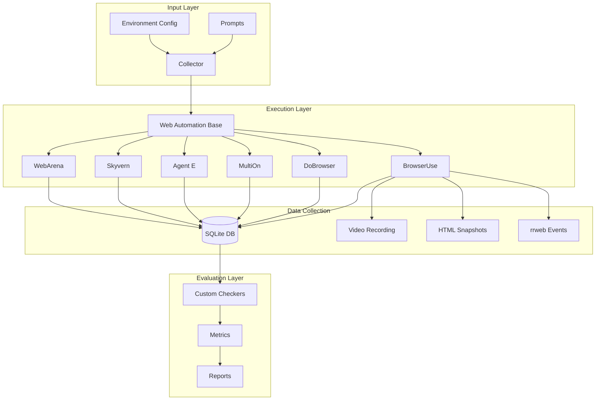

## System Architecture

LiteAgent follows a modular architecture designed for extensibility, scalability, and comprehensive data collection.



## Core Components

### 1. Collector Module

The **Collector** is the orchestration engine that manages the entire testing lifecycle:

- **Input Processing**: Reads prompts and configuration
- **Agent Management**: Instantiates and controls web automation agents
- **Data Recording**: Captures all interactions and outputs
- **Error Handling**: Manages timeouts and failures gracefully

Key files:
- `collector/main.py`: Entry point and task orchestration
- `collector/web_automation_factory.py`: Agent instantiation
- `collector/web_automation_base.py`: Base class for all agents

### 2. Web Automation Agents

Each agent inherits from `WebAutomationBase` and implements specific automation logic:

```python
class WebAutomationBase:
    def __init__(self, site, task, agent_method, ...):
        # Common initialization

    async def run_task(self):
        # Agent-specific implementation

    def record_action(self, event_type, ...):
        # Standardized data recording
```

### 3. Data Collection System

LiteAgent captures multiple types of data for comprehensive analysis:

#### Database Schema
```sql
CREATE TABLE actions (
    id INTEGER PRIMARY KEY,
    event_type VARCHAR(50),
    xpath VARCHAR(250),
    class_name VARCHAR(250),
    element_id VARCHAR(250),
    input_value VARCHAR(250),
    url VARCHAR(500),
    additional_info VARCHAR(500),
    time_since_last_action FLOAT
);
```

#### Data Types Collected
- **Interaction Events**: Clicks, typing, navigation
- **Visual Data**: Screenshots, video recordings
- **DOM Snapshots**: HTML at each interaction
- **Session Replay**: rrweb events for reconstruction
- **Performance Metrics**: Timing and resource usage

### 4. Evaluation System

The evaluation system analyzes collected data to determine:

- Task completion success
- Dark pattern susceptibility
- Performance metrics
- Behavioral patterns

## Design Principles

### 1. Modularity
Each component is independent and replaceable:
- Easy to add new agents
- Flexible evaluation criteria
- Pluggable data storage

### 2. Standardization
All agents follow the same interface:
- Consistent data format
- Uniform evaluation metrics
- Comparable results across agents

### 3. Extensibility
Built for growth:
- Simple to add new dark patterns
- Easy to create custom checkers
- Flexible prompt formats

### 4. Reproducibility
Every test can be replayed:
- Deterministic execution paths
- Complete data capture
- Version-controlled prompts

## Data Flow

<Steps>

<Step title="Prompt Creation">
User creates prompt files specifying:
- Target URL (with optional dark patterns)
- Task to perform
- Expected outcomes
</Step>

<Step title="Agent Execution">
Collector orchestrates:
- Browser launch
- Navigation to target
- Task execution
- Data recording
</Step>

<Step title="Data Storage">
Multiple formats captured:
- SQLite database for queries
- Video for visual review
- HTML for state analysis
- rrweb for interactive replay
</Step>

<Step title="Evaluation">
Automated analysis:
- Task completion checking
- Dark pattern detection
- Metric calculation
- Report generation
</Step>

</Steps>

## Parallel Execution

LiteAgent supports parallel execution for scalability:

```python
# Using asyncio for concurrent tasks
async def run_parallel_tests(agents, prompts):
    semaphore = asyncio.Semaphore(MAX_CONCURRENT)
    tasks = []

    for agent in agents:
        for prompt in prompts:
            task = run_with_semaphore(agent, prompt, semaphore)
            tasks.append(task)

    await asyncio.gather(*tasks)
```

Docker Compose enables easy parallelization:
```yaml
services:
  browseruse:
    deploy:
      replicas: 5  # Run 5 instances
```

## Error Handling

Robust error handling ensures data integrity:

### Timeout Management
- Configurable timeouts per task
- Graceful shutdown on timeout
- Partial data preservation

### Recovery Mechanisms
- Automatic retry logic
- State preservation on failure
- Detailed error logging

### Data Consistency
- Atomic database operations
- Checkpoint-based recovery
- Validation before storage

## Security Considerations

LiteAgent implements several security measures:

### Sandboxing
- Isolated browser profiles
- Separate data directories
- Limited file system access

### API Key Management
- Environment-based configuration
- No hardcoded credentials
- Secure key storage

### Data Privacy
- Local data storage by default
- No automatic uploads
- User-controlled sharing

## Performance Optimization

### Resource Management
- Browser instance pooling
- Memory limit enforcement
- CPU throttling options

### Caching
- Browser state caching
- Compiled prompt caching
- Result deduplication

### Monitoring
- Real-time progress tracking
- Resource usage metrics
- Performance profiling

## Integration Points

LiteAgent provides multiple integration options:

### API Integration
- RESTful endpoints for remote execution
- Webhook callbacks for results
- Streaming data export

### CI/CD Integration
- Docker-based deployment
- Command-line interface
- Exit codes for automation

### Data Export
- CSV for spreadsheets
- JSON for APIs
- SQLite for analysis tools

## Next Steps

<Card
  title="Understanding Agents"
  icon="robot"
  href="/concepts/agents"
>
  Learn about the different web automation agents
</Card>

<Card
  title="Dark Patterns"
  icon="shield-exclamation"
  href="/concepts/dark-patterns"
>
  Understand the dark patterns LiteAgent tests
</Card>

<Card
  title="Data Collection"
  icon="database"
  href="/concepts/data-collection"
>
  Explore the data collection mechanisms
</Card>