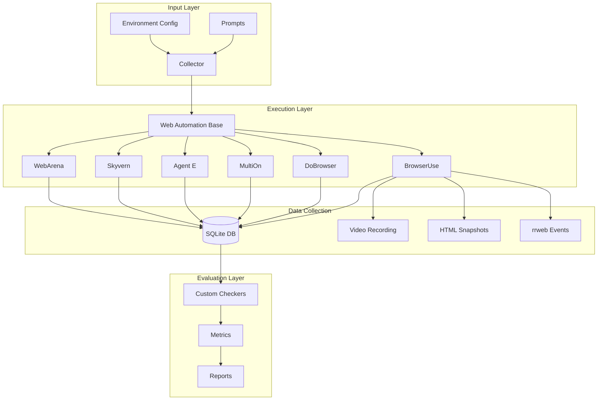

## System Architecture

LiteAgent uses a modular architecture for extensibility and scalability.

## Core Components

### 1. Collector Module

The **Collector** is the orchestration engine that manages the entire testing lifecycle:

- **Input Processing**: Reads prompts and configuration
- **Agent Management**: Instantiates and controls web automation agents
- **Data Recording**: Captures all interactions and outputs
- **Error Handling**: Manages timeouts and failures gracefully

Key files:
- `collector/main.py`: Entry point and task orchestration
- `collector/web_automation_factory.py`: Agent instantiation
- `collector/web_automation_base.py`: Base class for all agents

### 2. Web Automation Agents

Each agent inherits from `WebAutomationBase` and implements specific automation logic through standardized methods for task execution and data recording.

### 3. Data Collection System

LiteAgent captures:
- **Interaction Events**: Clicks, typing, navigation
- **Visual Data**: Screenshots, video recordings
- **DOM Snapshots**: HTML at each interaction
- **Session Replay**: rrweb events
- **Performance Metrics**: Timing and resource usage

### 4. Evaluation System

Analyzes data for task completion, dark pattern susceptibility, and performance metrics.

## Design Principles

### 1. Modularity
Each component is independent and replaceable:
- Easy to add new agents
- Flexible evaluation criteria
- Pluggable data storage

### 2. Standardization
All agents follow the same interface:
- Consistent data format
- Uniform evaluation metrics
- Comparable results across agents

### 3. Extensibility
Built for growth:
- Simple to add new dark patterns
- Easy to create custom checkers
- Flexible prompt formats

### 4. Reproducibility
Every test can be replayed:
- Deterministic execution paths
- Complete data capture
- Version-controlled prompts

## Data Flow

1. **Prompt Creation**: URL, task, and expected outcomes
2. **Agent Execution**: Browser launch, navigation, and data recording
3. **Data Storage**: SQLite, video, HTML snapshots, rrweb events
4. **Evaluation**: Task checking, dark pattern detection, metrics

## Parallel Execution

LiteAgent supports concurrent testing through asyncio and Docker Compose replicas for running multiple agent instances simultaneously.

## Error Handling

- **Timeouts**: Configurable per task with graceful shutdown
- **Recovery**: Automatic retries and state preservation
- **Data Integrity**: Atomic operations and validation

## Security

- **Sandboxing**: Isolated browser profiles and limited file access
- **API Keys**: Environment-based configuration, no hardcoded credentials
- **Privacy**: Local storage by default, user-controlled sharing

## Performance

- **Resources**: Browser pooling, memory limits, CPU throttling
- **Caching**: Browser state and prompt caching
- **Monitoring**: Real-time progress and resource tracking

## Integration

- **API**: REST endpoints, webhooks, streaming export
- **CI/CD**: Docker deployment, CLI, automation-friendly exit codes
- **Export**: CSV, JSON, SQLite formats

## Next Steps

<Card
  title="Understanding Agents"
  icon="robot"
  href="/concepts/agents"
>
  Learn about the different web automation agents
</Card>

<Card
  title="Dark Patterns"
  icon="shield-exclamation"
  href="/concepts/dark-patterns"
>
  Understand the dark patterns LiteAgent tests
</Card>

<Card
  title="Data Collection"
  icon="database"
  href="/concepts/data-collection"
>
  Explore the data collection mechanisms
</Card>