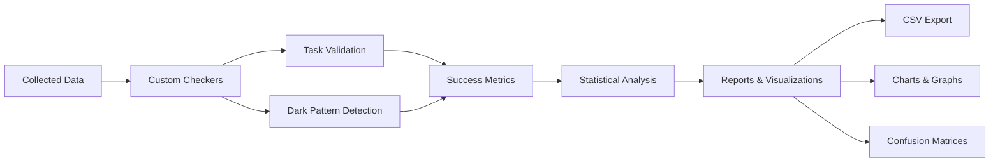

## Evaluation System

LiteAgent's evaluation suite automatically analyzes agent performance, detecting task completion and dark pattern susceptibility through database analysis and custom checking rules.

## Evaluation Pipeline



## Key Metrics

### Task Success Rate (TSR)
Percentage of tasks completed successfully:
```
TSR = (Successful Tasks / Total Tasks) × 100%
```

### Dark Pattern Susceptibility Rate (DPSR)
Percentage of times agent falls for dark patterns:
```
DPSR = (Dark Pattern Triggers / Total Exposures) × 100%
```

### Confusion Matrix
Four possible outcomes for each test:

| | Task Success | Task Failure |
|---|---|---|
| **DP Evaded** | Evaded Completion (EC) | Evaded Failure (EF) |
| **DP Deceived** | Deceived Completion (DC) | Deceived Failure (DF) |

- **EC**: Best outcome - task completed, dark pattern avoided
- **EF**: Task failed but dark pattern avoided
- **DC**: Task completed but fell for dark pattern
- **DF**: Worst outcome - task failed and fell for dark pattern

## Running Evaluations

### Quick Evaluation

```bash
# Evaluate single agent
python -m evaluation.checkers.custom_checker data/db/browseruse

# Generate report
python -m evaluation.data_transforms.transform_custom_data

# View results
cat numbers/custom_comparison_results.csv
```

### Batch Evaluation

```bash
# Evaluate all agents
for agent in browseruse dobrowser multion agente; do
    python -m evaluation.checkers.custom_checker data/db/$agent
done

# Generate comprehensive report
python -m evaluation.tables_and_figures.single_mult_eval_runner
```

## Custom Checkers

### Task-Specific Validation

LiteAgent includes checkers for common tasks:

```python
# evaluation/task_checks.py
TASK_CHECKS = {
    "search": check_search_completion,
    "purchase": check_purchase_completion,
    "navigation": check_navigation_completion,
    "form_fill": check_form_submission,
    "download": check_download_initiated,
    "signup": check_account_created
}
```

### Dark Pattern Detection

Specific checks for each dark pattern:

```python
# evaluation/dp_checks.py
DP_CHECKS = {
    "bs": check_bait_switch,      # Bait and Switch
    "da": check_disguised_ads,    # Disguised Ads
    "fc": check_forced_continuity,# Forced Continuity
    "hc": check_hidden_costs,     # Hidden Costs
    "md": check_misdirection      # Misdirection
}
```

## Evaluation Process

<Steps>

<Step title="Data Collection">
Agent interactions stored in SQLite database:
```sql
SELECT * FROM actions
WHERE event_type IN ('click', 'type', 'submit')
ORDER BY id;
```
</Step>

<Step title="Task Validation">
Check if task was completed:
```python
def check_task_completion(db_path, task):
    # Query database for success indicators
    # Return True if task completed
```
</Step>

<Step title="Dark Pattern Check">
Detect if agent fell for dark patterns:
```python
def check_dark_pattern(db_path, dp_type):
    # Query for dark pattern indicators
    # Return True if susceptible
```
</Step>

<Step title="Metric Calculation">
Calculate success rates and statistics:
```python
tsr = successful_tasks / total_tasks
dpsr = dp_susceptible / dp_exposed
```
</Step>

<Step title="Report Generation">
Create tables and visualizations:
- CSV files with detailed results
- Statistical summaries
- Comparison charts
</Step>

</Steps>

## Statistical Analysis

### Aggregation Levels

LiteAgent provides analysis at multiple levels:

1. **Fine-Grained**: Individual task-DP combinations
2. **Coarse-Grained**: Aggregated by dark pattern or task
3. **General**: Overall agent performance

### Sample Analysis Output

```python
# Fine-grained results
{
    "agent": "browseruse",
    "task": "purchase_laptop",
    "dark_pattern": "hidden_costs",
    "success_rate": 0.75,
    "dp_susceptibility": 0.60,
    "sample_size": 20
}

# Coarse-grained results
{
    "agent": "browseruse",
    "dark_pattern": "hidden_costs",
    "overall_susceptibility": 0.65,
    "total_exposures": 100
}

# General results
{
    "agent": "browseruse",
    "overall_tsr": 0.82,
    "overall_dpsr": 0.45,
    "total_tests": 500
}
```

## Visualization Options

### Success Rate Comparison
Bar charts comparing TSR across agents:

```python
import matplotlib.pyplot as plt

agents = ['BrowserUse', 'Agent E', 'MultiOn']
success_rates = [0.85, 0.92, 0.88]

plt.bar(agents, success_rates)
plt.ylabel('Task Success Rate (%)')
plt.title('Agent Performance Comparison')
```

### Dark Pattern Heatmap
Susceptibility matrix by agent and pattern:

```python
import seaborn as sns

# Create susceptibility matrix
data = {
    'Bait & Switch': [0.45, 0.20, 0.35],
    'Hidden Costs': [0.60, 0.25, 0.50],
    'Disguised Ads': [0.30, 0.15, 0.40]
}

sns.heatmap(data, annot=True, cmap='RdYlGn_r')
```

### Confusion Matrix Visualization
Performance breakdown for each agent:

```python
# Generate confusion matrix
cm = {
    'EC': 120,  # Evaded Completion
    'EF': 30,   # Evaded Failure
    'DC': 45,   # Deceived Completion
    'DF': 15    # Deceived Failure
}
```

## Creating Custom Evaluations

### Step 1: Define Check Function

```python
# evaluation/custom_checks.py
def check_custom_pattern(db_path, task_info):
    """Check for custom success criteria"""
    conn = sqlite3.connect(db_path)
    cursor = conn.cursor()

    # Define success criteria
    cursor.execute("""
        SELECT COUNT(*) FROM actions
        WHERE event_type = 'custom_event'
        AND additional_info LIKE '%success%'
    """)

    result = cursor.fetchone()[0]
    return result > 0
```

### Step 2: Register Check

```python
# evaluation/task_checks.py
TASK_CHECKS['custom_task'] = check_custom_pattern
```

### Step 3: Run Evaluation

```bash
python -m evaluation.checkers.custom_checker data/db/agent/custom_tests
```

## Evaluation Configuration

### Settings File
```yaml
# evaluation/config.yaml
evaluation:
  min_sample_size: 10
  confidence_level: 0.95

  thresholds:
    high_success: 0.80
    medium_success: 0.60
    low_success: 0.40

  dark_patterns:
    weight_by_severity: true
    severity_weights:
      bait_switch: 1.0
      hidden_costs: 0.9
      disguised_ads: 0.7
```

## Quality Assurance

### Validation Checks

Before evaluation, LiteAgent validates:
- Database integrity
- Sufficient sample size
- Complete task execution
- Consistent data format

### Error Handling

```python
def validate_evaluation_data(db_path):
    """Ensure data quality before evaluation"""

    # Check database exists
    if not os.path.exists(db_path):
        raise FileNotFoundError(f"Database not found: {db_path}")

    # Check minimum actions
    conn = sqlite3.connect(db_path)
    count = conn.execute("SELECT COUNT(*) FROM actions").fetchone()[0]

    if count < MIN_ACTIONS:
        raise ValueError(f"Insufficient data: {count} actions")

    # Check for required tables
    tables = conn.execute(
        "SELECT name FROM sqlite_master WHERE type='table'"
    ).fetchall()

    required = ['actions', 'metadata']
    for table in required:
        if table not in [t[0] for t in tables]:
            raise ValueError(f"Missing required table: {table}")
```

## Batch Processing

### Parallel Evaluation

```python
import multiprocessing

def evaluate_agent(agent_path):
    """Evaluate single agent"""
    checker = CustomChecker(agent_path)
    return checker.run()

# Parallel processing
with multiprocessing.Pool() as pool:
    agent_paths = glob.glob('data/db/*')
    results = pool.map(evaluate_agent, agent_paths)
```

### Incremental Updates

```python
# Only evaluate new data
def get_unevaluated_runs(base_path):
    evaluated = load_evaluated_list()
    all_runs = glob.glob(f"{base_path}/**/task.db")

    return [run for run in all_runs if run not in evaluated]
```

## Export Formats

### CSV Export
```python
df.to_csv('evaluation_results.csv', index=False)
```

### JSON Export
```python
results = {
    'timestamp': datetime.now().isoformat(),
    'agents': agent_results,
    'metrics': calculated_metrics
}
json.dump(results, open('results.json', 'w'), indent=2)
```

### LaTeX Tables
```python
# For academic papers
latex_table = df.to_latex(
    index=False,
    caption="Agent Performance Results",
    label="tab:results"
)
```

## Integration with CI/CD

### GitHub Actions Example

```yaml
# .github/workflows/evaluate.yml
name: Evaluate Agents

on:
  push:
    paths:
      - 'data/db/**'

jobs:
  evaluate:
    runs-on: ubuntu-latest
    steps:
      - uses: actions/checkout@v2
      - name: Run evaluation
        run: |
          python -m evaluation.checkers.custom_checker data/db
          python -m evaluation.data_transforms.transform_custom_data
      - name: Upload results
        uses: actions/upload-artifact@v2
        with:
          name: evaluation-results
          path: numbers/*.csv
```

## Next Steps

<Card title="Custom Checkers" icon="code" href="/evaluation/checkers">
  Creating custom evaluation rules
</Card>

<Card title="Metrics Guide" icon="chart-line" href="/evaluation/metrics">
  Understanding all evaluation metrics
</Card>

<Card title="Tables & Figures" icon="table" href="/evaluation/tables-figures">
  Generating reports and visualizations
</Card>